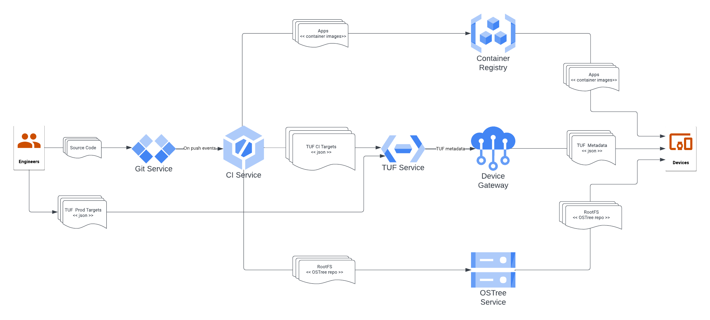
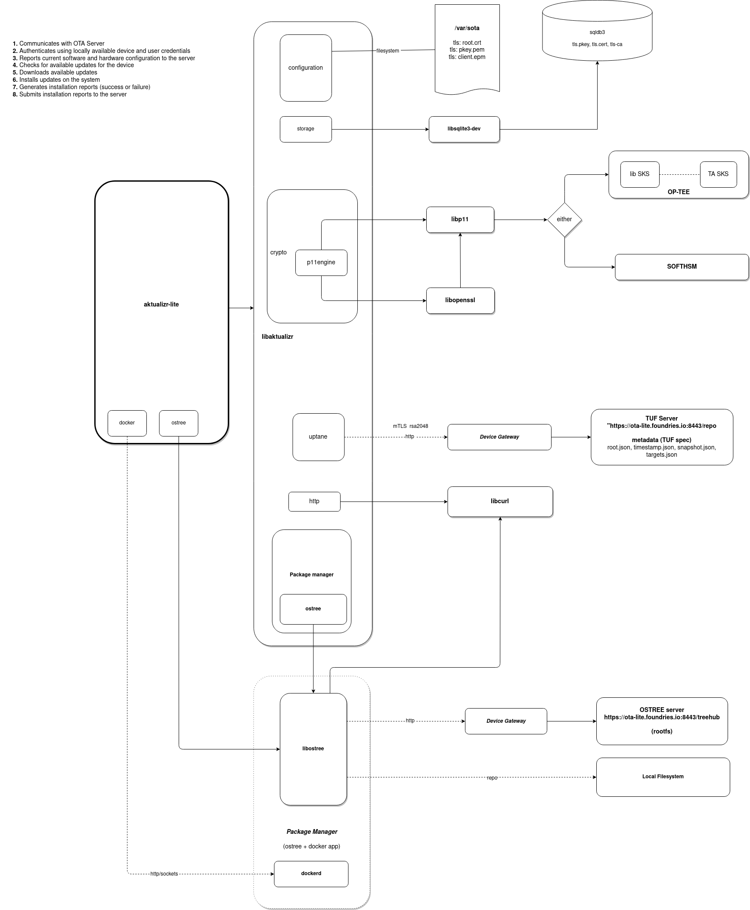

# Architecture Overview

## Part of the FoundriesFactory™ Platform

`aktualizr-lite` is a key component of FoundriesFactory™, the platform offered by Foundries.io provides 
end-to-end solution for IoT and Edge devices producers to build and OTA update OS and applications on their devices.
It is embedded into [the Foundries.io™ Linux® microPlatform (LmP)](https://docs.foundries.io/latest/reference-manual/linux/linux.html) - Linux-based OS composed by means of [Yocto Framework](https://docs.yoctoproject.org/).

FoundriesFactory™ enables:
1. **Assembling custom Linux-based OS through the Yocto framework**

2. **CI-Driven Builds and Deployments**
   1. A CI service builds your custom OS and publishes it as an OSTree repository.
   2. Another CI service builds and pushes your Compose Apps to the Foundries.io registry (or a third-party registry).

3. **Secure OTA Delivery**  
   Updates are signed and verified using the TUF framework, and delivered using a proprietary
   Wave mechanism that enables controlled rollout of updates across fleets of devices.

## System Overview
The following diagram depicts conceptual architecture on the FoundriesFactory solution.

`aktualizr-lite` is a component running on devices and performs OTA update through interaction with the Device Gateway,
the OSTree Service, and a container registry (FoundriesFactory's or 3rd party, e.g. github container registry)

The following diagram shows the key components used in aktualizr-lite
and how they interact with FountriesFactory™ services.

